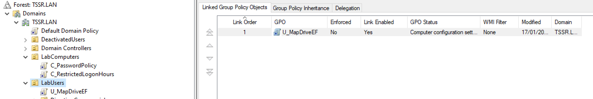
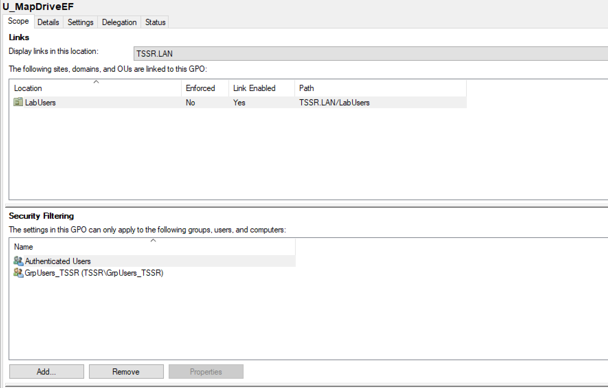

# Checkpoint 3 - Exercice 1 - Manipulations pratiques sur VM Windows

## Partie 1 : Gestion des utilisateurs

**Q.1.1.1** Créer l'utilisateur Lionel Lemarchand avec les même attribut de société que Kelly Rhameur.  

```
# cherche kelly dans l'ad
$kelly=get-aduser -filter { givenname -like "kelly"} -Properties company, department, title

# crée lionel avec les mêmes attributs que kelly
New-ADUser -Name "Lionel Lemarchand" -DisplayName "Lionel Lemarchand" -SamAccountName "Lionel.Lemarchand" -UserPrincipalName "Lionel.Lemarchand@TSSR.LAN" -GivenName Lionel -Surname Lemarchand -Title $kelly.Title -Path "OU=DirectionDesRessourcesHumaines,OU=LabUsers,DC=TSSR,DC=LAN" -AccountPassword (ConvertTo-SecureString -AsPlainText Azerty1* -Force) -Enabled $True-OtherAttributes @{Company = $Kelly.Company; Department = $kelly.Department } -Manager $kelly.manager

# change tous les subordonnés de kelly pour lionel
$subs=get-aduser -filter { manager -eq $kelly} 
foreach ($sub in $subs) { Set-ADUser -Identity $sub -Manager "Lionel.Lemarchand"}
```
  

**Q.1.1.2** Créer une OU DeactivatedUsers et déplace le compte désactivé de Kelly Rhameur dedans.  
  
  
(je n'ai pas trouvé comment éditer une image sur linux, mais cliquer sur "disable")  
  

**Q.1.1.3** Modifier le groupe de l'OU dans laquelle était Kelly Rhameur en conséquence.  
  

**Q.1.1.4** Créer le dossier Individuel du nouvel utilisateur et archive celui de Kelly Rhameur en le suffixant par -ARCHIVE.  

  
  
 

--- 

## Partie 2 : Restriction utilisateurs

**Q.1.2.1** Faire en sorte que l'utilisateur Gabriel Ghul ne puisse se connecter que du lundi au vendredi, de 7h à 17h.  
  
 


**Q.1.2.2** De même, bloquer sa connexion au seul ordinateur CLIENT01.  
  

**Q.1.2.3** Mettre en place une stratégie de mot de passe pour durcir les comptes des utilisateurs de l'OU LabUsers.  
  
   

---

## Partie 3 : Lecteurs réseaux

**Q.1.3.1** Créer une GPO Drive-Mount qui monte les lecteurs E: et F: sur les clients.  

  
   
  
   
  
   
   
   
   
   
   


