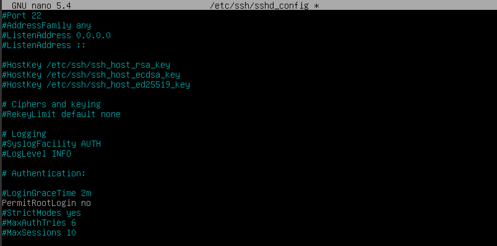
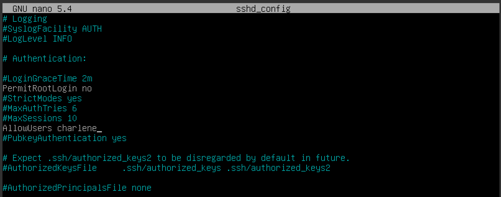
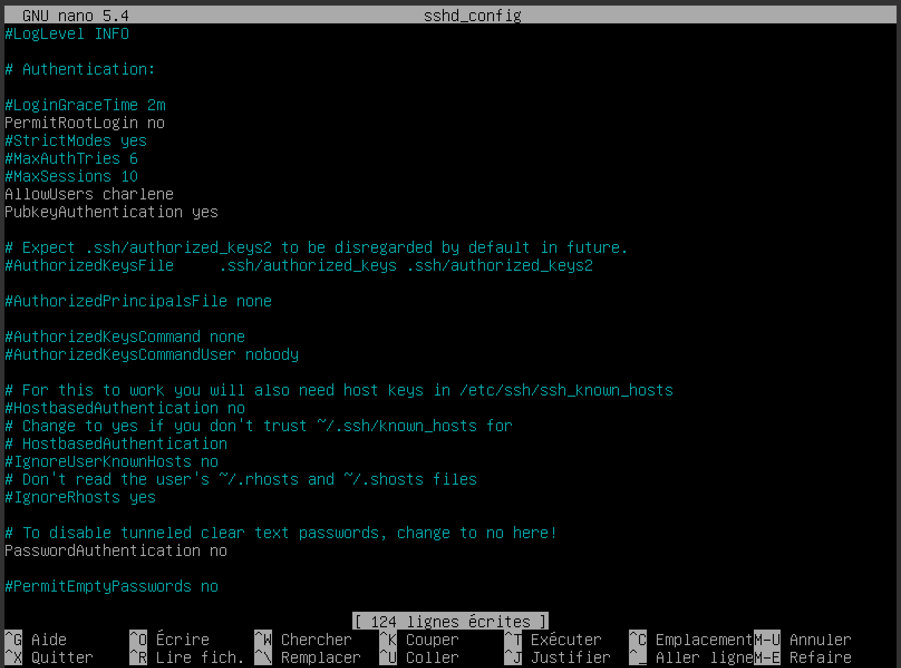
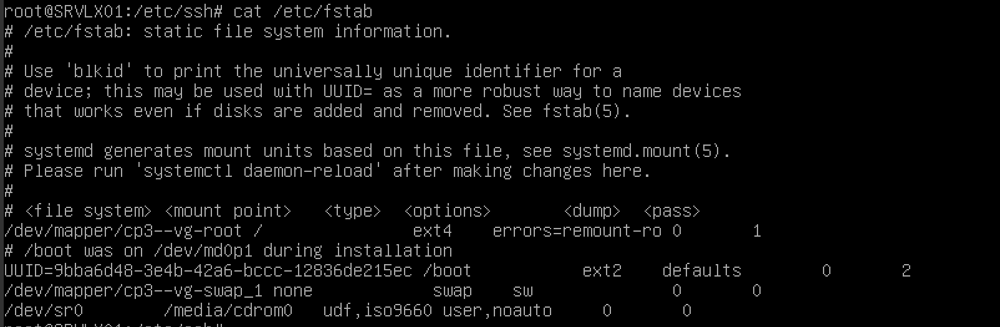
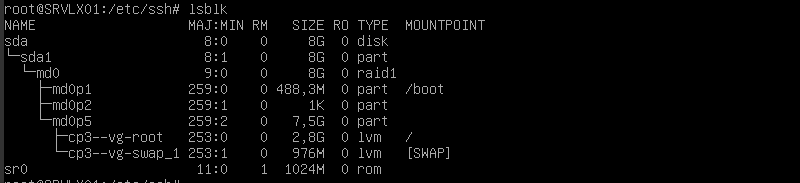
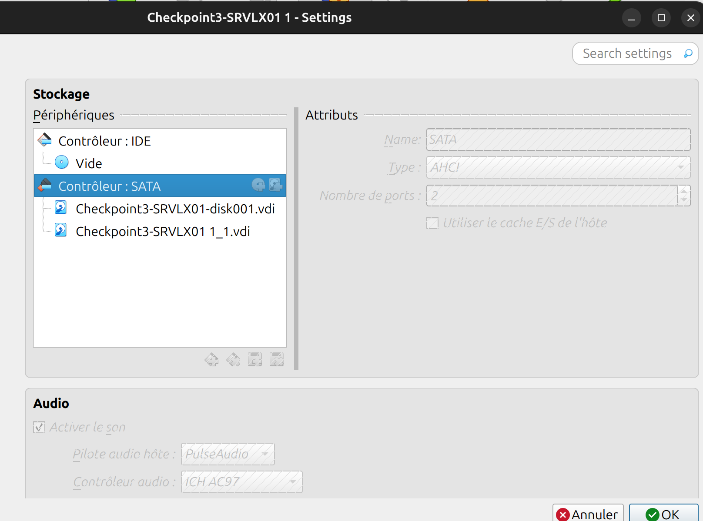
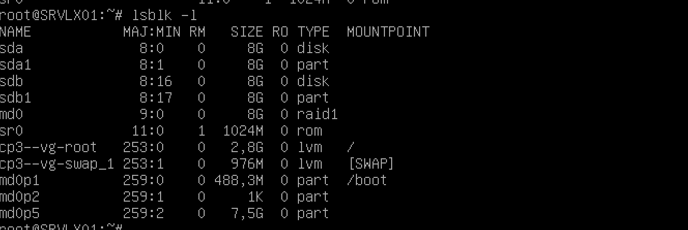
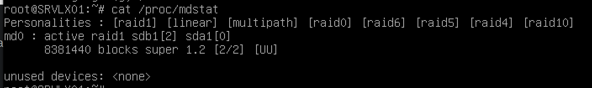
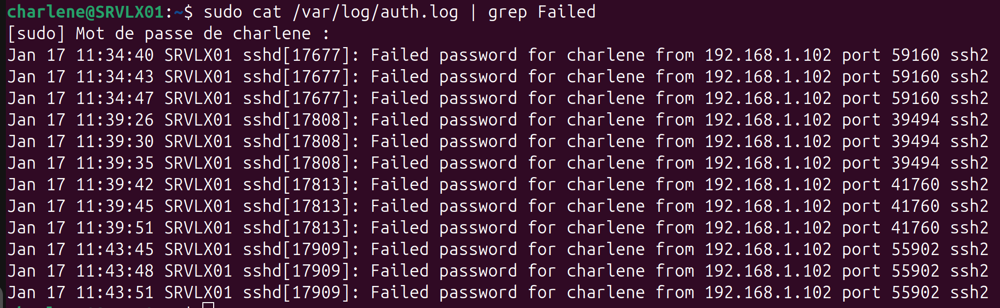

# Checkpoitn 3 - Exercice 2 : Manipulations pratiques sur VM Linux 

## Partie 1 : Gestion des utilisateurs

**Q.2.1.1** Sur le serveur, créer un compte pour ton usage personnel.  
```
    # création de l'utilisateur
    adduser charlene
    # installation du sudo
    apt install sudo
    # ajout de l'utilisateur au groupe Sudo
    addgroup charlene sudo
```

**Q.2.1.2** Quelles préconisations proposes-tu concernant ce compte ?  
Il faut choisir un mot de passe fort avec une date d'expiration.  
Il faut limiter les droits et l'ajouter au groupe Sudo seulement si nécessaire.  
Il faut vérifier les différents droits d'accès en utilisant la méthode du moindre privilège.  
Il faut également désactiver l'utilisateur, voire le supprimer quand il n'y en aura plus besoin.  

## Partie 2 : Configuration de SSH

Un serveur SSH est lancé sur le port par défaut.
Il est possible de s'y connecter avec n'importe quel compte, y compris le compte root.

**Q.2.2.1** Désactiver complètement l'accès à distance de l'utilisateur root.  


**Q.2.2.2** Autoriser l'accès à distance à ton compte personnel uniquement.


**Q.2.2.3** Mettre en place une authentification par clé valide et désactiver l'authentification par mot de passe
```
ssh-keygen
ssh-copy-it charlene@192.268.1.102
```




## Partie 3 : Analyse du stockage

**Q.2.3.1** Quels sont les systèmes de fichiers actuellement montés ?  
Il y a un swap, un ext4 et un ext2.  


**Q.2.3.2** Quel type de système de stockage ils utilisent ?
Ils utilisent du LVM sur un RAID 1.  



**Q.2.3.3** Ajouter un nouveau disque de 8,00 Gio au serveur et réparer le volume RAID
  
```
fdisk /dev/sdb
mkfs.ext4 /dev/sdb1
```  
  
```mdadm --manage /dev/md0 --add /dev/sdb1```
  


**Q.2.3.4** Ajouter un nouveau volume logique LVM de 2 Gio qui servira à héberger des sauvegardes. Ce volume doit être monté automatiquement à chaque démarrage dans l'emplacement par défaut : /var/lib/bareos/storage.

**Q.2.3.5** Combien d'espace disponible reste-t-il dans le groupe de volume ?

## Partie 4 : Sauvegardes

Le logiciel bareos est installé sur le serveur.
Les composants bareos-dir, bareos-sd et bareos-fd sont installés avec une configuration par défaut.

**Q.2.4.1** Expliquer succinctement les rôles respectifs des 3 composants bareos installés sur la VM.  
*Bareos-dir* sert à la planification et au contrôle des sauvegardes. *Bareos-sd* sauvergarde sur les différents supports. *Bareos-fd* est sur les machines à sauvegarder, il envoie les informations à sauvegarder.  

## Partie 5 : Filtrage et analyse réseau

**Q.2.5.1** Quelles sont actuellement les règles appliquées sur Netfilter ?

```
charlene@SRVLX01:~$ sudo nft list ruleset
table inet inet_filter_table {
	chain in_chain {
		type filter hook input priority filter; policy drop;
		ct state established,related accept
		ct state invalid drop
		iifname "lo" accept
		tcp dport 22 accept
		ip protocol icmp accept
		ip6 nexthdr ipv6-icmp accept
	}
}

```

**Q.2.5.2** Quels types de communications sont autorisées ?
Les communications qui sont établies et connues peuvent envoyer et recevoir tous les paquets.  
Si la communication est inconnue, elle est rejetée.
Sauf si cela concerne l'interface loopback, le port SSH (port 22) ou un ping en ipv4 ou ipv6ping EN ENTRÉE.  


**Q.2.5.3** Quels types sont interdit ?
Tout ce qui n'est pas cité à la réponse 2.5.2 est interdit.  

**Q.2.5.4** Sur nftables, ajouter les règles nécessaires pour autoriser bareos à communiquer avec les clients bareos potentiellement présents sur l'ensemble des machines du réseau local sur lequel se trouve le serveur.

Rappel : Bareos utilise les ports TCP 9101 à 9103 pour la communication entre ses différents composants.
```
sudo nft add chain inet inet_filter_table output { type filter hook output priority 100 \; }
sudo nft add rule inet inet_filter_table output drop
sudo nft add rule inet inet_filter_table output ip daddr { 192.168.1.0-192.168.1.255 } accept
sudo nft add rule inet inet_filter_table output tcp  dport { 9101, 9102, 9103 }  accept
```

## Partie 6 : Analyse de logs

**Q.2.6.1** Lister les 10 derniers échecs de connexion ayant eu lieu sur le serveur en indiquant pour chacun :

La date et l'heure de la tentative
L'adresse IP de la machine ayant fait la tentative

  

Les 10 derniers échecs de connexion ont été fait le 17 janvier à 11h34, 11h34 et 11h39 par l'adresse IP 192.168.1.102.  

